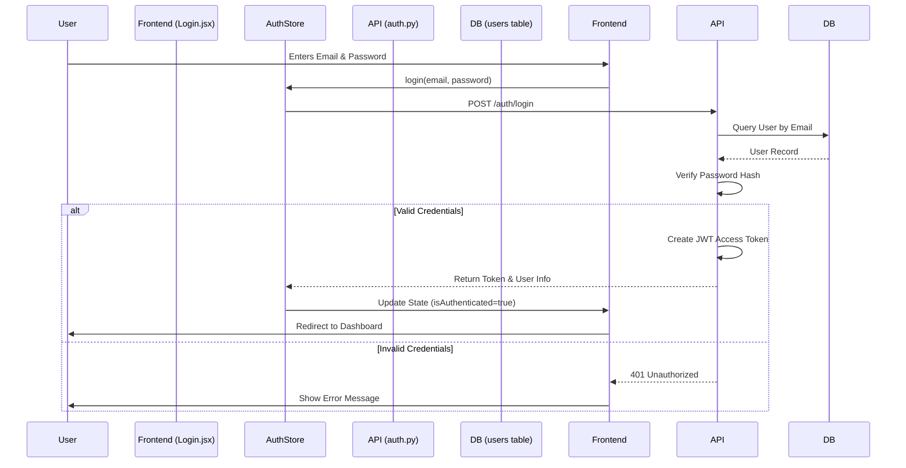
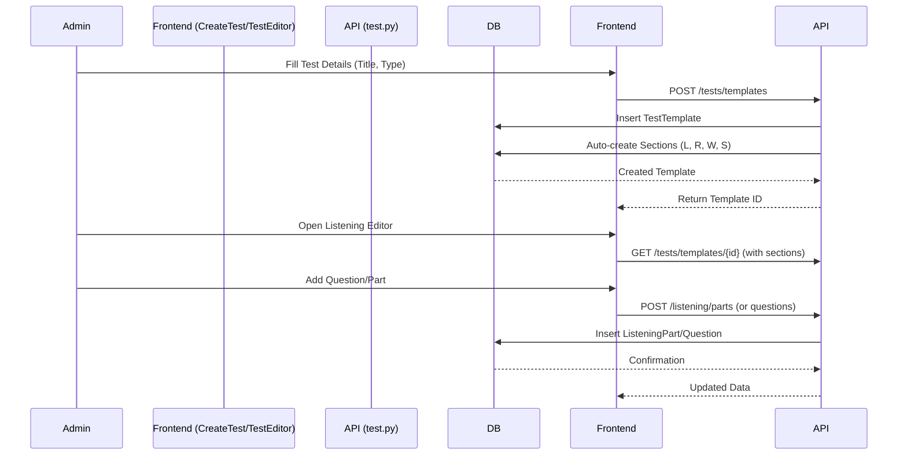
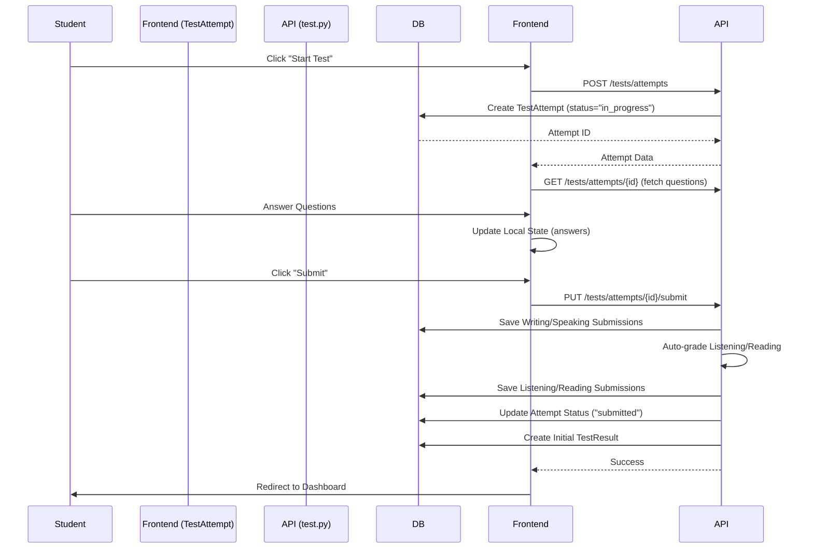
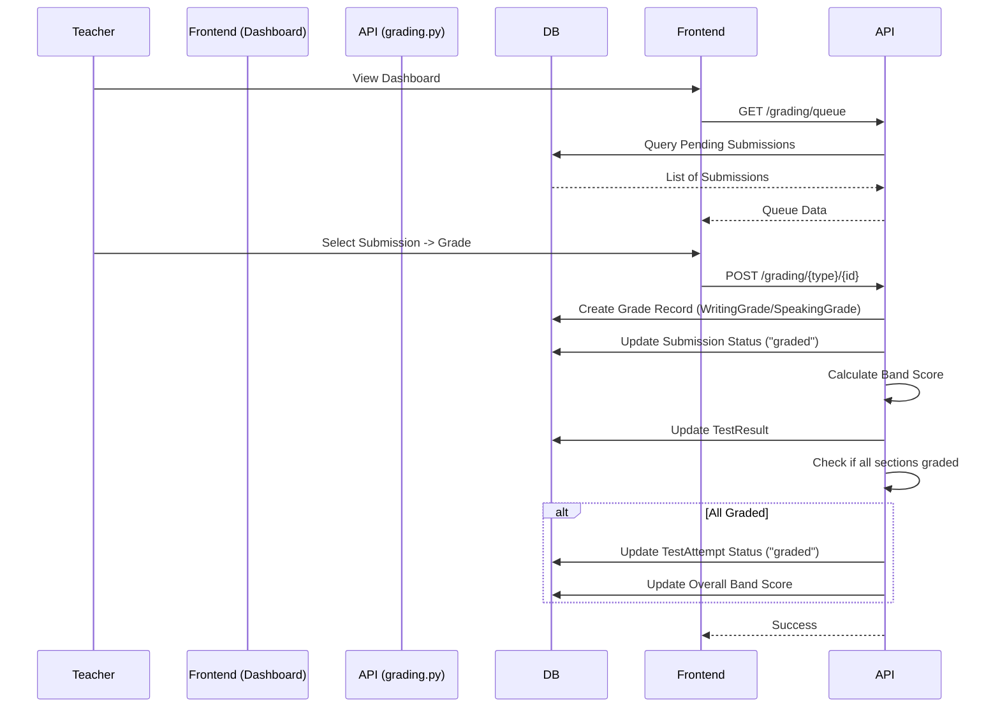
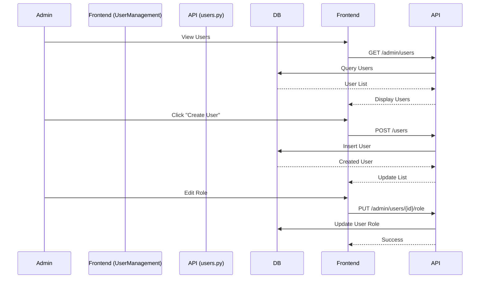

# ACE Platform Data Flow Documentation

This document outlines the data flow for the key tasks within the ACE Platform.

## 1. Authentication Flow

**Goal**: Authenticate users (Student, Teacher, Admin) and issue access tokens.

### Flow Diagram

### Key Components

- **Frontend**: `src/pages/auth/Login.jsx`, `src/store/authStore.js`
- **Backend**: `app/routers/auth.py`, `app/core/security.py`
- **Database**: `users` table

---

## 2. Test Creation Flow (Admin)

**Goal**: Create a full IELTS test template with sections and questions.

### Flow Diagram

### Key Components

- **Frontend**: `src/pages/admin/CreateTest.jsx`, `src/pages/admin/TestEditor.jsx`, `src/pages/admin/editors/*`
- **Backend**: `app/routers/test.py`, `app/routers/listening.py`, `app/routers/reading.py`, etc.
- **Database**: `test_templates`, `test_sections`, `listening_parts`, `reading_passages`, etc.

---

## 3. Test Taking Flow (Student)

**Goal**: Student attempts a test, saves answers, and submits for grading.

### Flow Diagram

### Key Components

- **Frontend**: `src/pages/student/TestAttempt.jsx`
- **Backend**: `app/routers/test.py`
- **Database**: `test_attempts`, `listening_submissions`, `reading_submissions`, `writing_submissions`, `speaking_submissions`

---

## 4. Grading Flow (Teacher)

**Goal**: Teacher grades Writing and Speaking submissions.

### Flow Diagram

### Key Components

- **Frontend**: `src/pages/teacher/Dashboard.jsx`, `src/pages/teacher/GradeWriting.jsx`
- **Backend**: `app/routers/grading.py`, `app/services/grading_service.py`
- **Database**: `writing_grades`, `speaking_grades`, `test_results`

---

## 5. Student Management Flow (Admin)

**Goal**: Admin manages user accounts (create, update, delete).

### Flow Diagram

### Key Components

- **Frontend**: `src/pages/admin/UserManagement.jsx`
- **Backend**: `app/routers/users.py`
- **Database**: `users` table
